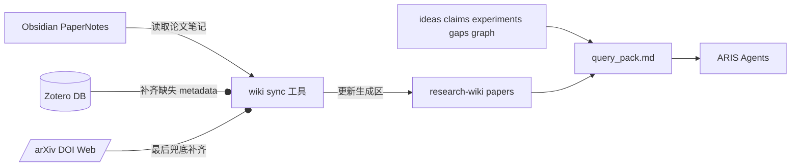

# Obsidian Paper Notes to ARIS Research Wiki Integration Implementation Plan

> **For agentic workers:** REQUIRED SUB-SKILL: Use `superpowers:subagent-driven-development` (recommended) or `superpowers:executing-plans` to implement this plan task-by-task. Steps use checkbox (`- [ ]`) syntax for tracking.

**Goal:** Integrate Obsidian paper notes into `research-wiki` while keeping `research-wiki` as the ARIS project-state layer rather than a replacement personal knowledge base.

**Architecture:** Obsidian remains the source of truth for full paper notes. `research-wiki/papers/*.md` becomes a lightweight, generated projection for agents, enriched from Zotero or web metadata only when Obsidian lacks required fields. ARIS project state continues to live in `ideas/`, `claims/`, `experiments/`, `gap_map.md`, `graph/`, and `query_pack.md`.

**Tech Stack:** Python CLI in `tools/research_wiki.py`, Markdown files under `research-wiki/`, Obsidian paper notes, read-only Zotero sqlite metadata, optional arXiv/DOI/web fallback.

---

## 1. Review Context

This plan is intended for other agents to review before implementation. It records the agreed product boundary, motivation, target data flow, expected system impact, and implementation tasks.

The user currently uses `/Users/bytedance/Tools/dailypaper-skills/ARCHITECTURE.md` and the related `paper-reader` skill to maintain Obsidian paper notes and concept notes. That system is the long-term personal knowledge base.

This ARIS repository also has a `research-wiki` workflow. The existing wiki can store papers, ideas, claims, experiments, gaps, and graph edges. The unresolved issue is overlap: Obsidian already knows what papers were read, while `research-wiki/papers/*.md` also stores paper pages.

The agreed decision is:

- Obsidian owns full paper knowledge.
- Obsidian concept notes are out of scope for the wiki.
- `research-wiki` owns ARIS project state.
- `research-wiki/papers/*.md` remains, but only as an agent-facing paper projection.
- Wiki paper projections should preserve hand-written ARIS project notes.

## 2. Existing Research Wiki Behavior

Current implementation is centered around `tools/research_wiki.py`.

Known current behavior:

- `init` creates `research-wiki/{papers,ideas,experiments,claims,graph}/`, `index.md`, `log.md`, `gap_map.md`, `query_pack.md`, and `graph/edges.jsonl`.
- `ingest_paper` creates `papers/<slug>.md`, optionally fetches arXiv metadata, deduplicates by arXiv id and slug, rebuilds `index.md` and `query_pack.md`, and appends `log.md`.
- Current paper pages contain frontmatter plus mostly human/TODO-style sections such as one-line thesis, problem, method, limitations, reusable ingredients, claims, connections, and project relevance.
- The current slug rule is based on first author, year, and title keywords, for example `<author><year>_<keyword_keyword_keyword>`.
- `query_pack.md` currently reads research brief, gap map, failed/mixed ideas, paper title plus one-line thesis, and recent graph edges.
- `query_pack.md` does not yet summarize `claims/*.md` or `experiments/*.md`.

The planned change should preserve the existing ARIS wiki shape while replacing paper-page content semantics.

## 3. Motivation

The current split creates duplicated and uneven memory:

- Obsidian notes are richer and are already connected to Zotero and the user's paper-reading workflow.
- Wiki paper pages are useful to ARIS agents, but they are too sparse or manually maintained.
- If both systems try to be full paper knowledge bases, they will diverge.
- If wiki sync overwrites full pages, it can destroy useful project-specific manual notes.

The target design turns Wiki paper pages into a controlled projection:

- Small enough for agents to consume.
- Stable enough for `query_pack.md`.
- Linked back to Obsidian for full context.
- Safe to regenerate without destroying manual project notes.

## 4. Target Data Flow



Data ownership:

- Obsidian paper notes: full paper reading content, summaries, method details, related notes, reading context.
- Obsidian concept notes: not read or written by this integration.
- Zotero: read-only metadata enrichment source.
- Web metadata: last-resort enrichment source when Obsidian and Zotero are insufficient.
- `research-wiki/papers/*.md`: generated lightweight projection plus preserved local project notes.
- `query_pack.md`: compact context bundle for ARIS agents.

## 5. Non-Goals

- Do not write back to Obsidian.
- Do not write to Zotero.
- Do not create or maintain `research-wiki/concepts/*.md`.
- Do not parse Obsidian concept notes.
- Do not migrate all historical wiki content automatically in the first implementation unless explicitly requested later.
- Do not resolve the potential conflict with `research-lit sources: obsidian` in this plan.
- Do not auto-convert related-paper references into `graph/edges.jsonl` edges in v1.

## 6. Public Interface

Add a new sync command to `tools/research_wiki.py`.

Proposed CLI:

```bash
python tools/research_wiki.py sync-obsidian research-wiki \
  --paper-notes-dir "/Users/bytedance/Library/Mobile Documents/iCloud~md~obsidian/Documents/ob-career/001-input/PaperRead/PaperNotes" \
  --zotero-db "/Users/bytedance/Zotero/zotero.sqlite" \
  --dry-run
```

Arguments:

- `wiki_dir`: target `research-wiki` directory.
- `--paper-notes-dir`: Obsidian paper note directory.
- `--zotero-db`: optional read-only Zotero sqlite path.
- `--dry-run`: compute planned creates, updates, conflicts, and skips without writing files.
- `--limit`: optional debugging limit for syncing a small number of notes, selected by note mtime descending.
- `--report`: optional path for a sync report file.
- `--match-loose`: optional fallback matching by normalized title and `method_name`; disabled by default.

Default behavior:

- Without `--dry-run`, update only generated projection regions in Wiki paper files.
- Rebuild `index.md` and `query_pack.md` after successful sync.
- Append a concise sync event to `log.md`.
- Emit a terminal summary with counts for created, updated, unchanged, skipped, and conflicts.

## 7. Paper Identity and Matching

Use stable matching to avoid duplicate paper files and slug churn.

Default priority order:

1. `zotero_item_id`
2. `zotero_item_key`
3. legacy `zotero_key`
4. `doi`
5. `arxiv_id`

Loose priority order, enabled only with `--match-loose`:

6. normalized title
7. `method_name`

Rules:

- If an Obsidian note matches an existing Wiki paper, preserve the existing `node_id` and filename.
- Do not rename existing files during sync.
- Only create a new `papers/<slug>.md` when no existing match is found.
- For new pages, reuse the existing `slugify(title, author_last, year)` behavior.
- If multiple existing pages match the same note, skip the note and report a conflict.
- If multiple Obsidian notes match the same existing Wiki page, skip later duplicates and report a conflict.
- Do not use normalized title or `method_name` matching unless `--match-loose` is explicitly set, because method names can collide across papers.

## 8. Wiki Paper Page Format

Target file structure:

```markdown
---
type: paper
node_id: paper:<slug>
source: obsidian
obsidian_path: <vault-relative-path>
title: <title>
method_name: <method_name>
authors: []
year: null
venue: null
external_ids:
  arxiv: null
  doi: null
  s2: null
zotero:
  item_id: null
  item_key: null
  collection: null
tags: []
projection_updated: <iso8601>
---

# <title>

<!-- BEGIN OBSIDIAN PROJECTION -->
## Agent Summary

- One-line:
- Core problem:
- Key insight:
- System bottleneck:
- Method:
- Key results:
- Limitations:
- Reusable lessons:

## Evaluation Hints

- Workloads:
- Baselines:
- Metrics:
- Artifacts / code:
- Repro risk:

## Related Papers

- paper_ref:
<!-- END OBSIDIAN PROJECTION -->

<!-- BEGIN PROJECT NOTES -->
## Relevance to Current ARIS Project

Manual ARIS notes go here.

## Local Claim / Gap Notes

Manual ARIS notes go here.
<!-- END PROJECT NOTES -->
```

Update rules:

- The sync command may rewrite YAML frontmatter fields that are part of the generated projection.
- The sync command may rewrite only content between `BEGIN OBSIDIAN PROJECTION` and `END OBSIDIAN PROJECTION`.
- The sync command must preserve content between `BEGIN PROJECT NOTES` and `END PROJECT NOTES`.
- If a legacy Wiki paper page has no markers, create both marker regions and preserve existing body content under project notes or a legacy section.
- Store `obsidian_path` as vault-relative when the input path is under the Obsidian vault root; the CLI may still accept absolute `--paper-notes-dir` paths.
- `ingest_paper` should render the new frontmatter and marker schema too, with an empty `OBSIDIAN PROJECTION` region and project notes initialized from the existing manual sections.
- Historical pages are migrated lazily: only pages touched by `sync-obsidian` or `ingest_paper` get markers and schema updates in v1.

Legacy field mapping:

- `added`: preserve as `legacy_added` when present; new pages use `projection_updated`.
- `## One-line thesis`: move into project notes unless an Obsidian projection supplies `One-line`.
- `## Problem`, `## Method`, `## Limitations`, `## Reusable ingredients`, `## Claims`, `## Connections`, and `## Project relevance`: preserve under project notes or a dedicated legacy subsection.
- Unknown legacy frontmatter keys: preserve unless they conflict with generated projection fields.

## 9. Obsidian Extraction Mapping

The relevant Obsidian template is:

`/Users/bytedance/Tools/dailypaper-skills/skills/paper-reader/assets/paper-note-template.md`

Read these frontmatter fields when present:

- `title`
- `method_name`
- `authors`
- `year`
- `venue`
- `tags`
- `zotero_item_id`
- `zotero_item_key`
- `zotero_key`
- `zotero_collection`
- `doi`
- `arxiv_id`
- `arxiv_html`
- `created`

Map Obsidian body sections to agent-facing fields:

- `One-line`: `## 一句话总结`
- `Core problem`: `这篇论文为什么重要`, `问题定义与瓶颈`
- `Key insight`: `关键 insight`, `作者核心 Insights`
- `System bottleneck`: `### 系统瓶颈`
- `Method`: `系统设计总览`, `关键机制拆解`
- `Key results`: `核心结果`
- `Limitations`: `批判性思考`
- `Reusable lessons`: `经验与可迁移启示`
- `Workloads`: `实验设置`
- `Baselines`: `实验设置`
- `Metrics`: `实验设置`
- `Related Papers`: `相关工作定位` and paper-like wikilinks in paper notes

Extraction constraints:

- Keep projection fields compact and agent-facing.
- Prefer 1 to 3 bullets per field.
- Do not copy long Obsidian sections into Wiki.
- Do not extract from Obsidian concept notes.
- Related papers should be stored as structured text references in the paper projection, not as automatic graph edges.

## 10. Metadata Enrichment Policy

Precedence:

1. Obsidian note frontmatter/body.
2. Read-only Zotero metadata.
3. arXiv/DOI/web metadata fallback.

Rules:

- Obsidian values win when present.
- Zotero may fill only empty fields.
- Web metadata may fill only fields still empty after Obsidian and Zotero.
- Conflicting values must be reported, not silently overwritten.
- Zotero access must use `sqlite3.connect("file:...?mode=ro&immutable=1", uri=True)` by default.
- If the Zotero database cannot be opened read-only, or a live Zotero lock is detected, copy the sqlite file to `/tmp` and read the copy.
- The sync command must not mutate the Zotero database.

Conflict examples:

- Obsidian title differs materially from Zotero title.
- Obsidian DOI differs from Zotero DOI.
- Obsidian year differs from Zotero year.
- Obsidian arXiv id differs from arXiv id inferred from DOI or URL.

## 11. Query Pack Redesign

`query_pack.md` should become the compact ARIS agent context bundle.

Inputs:

- `RESEARCH_BRIEF.md`
- `gap_map.md`
- failed or mixed `ideas/*.md`
- generated fields from `papers/*.md`
- `claims/*.md`
- `experiments/*.md`
- recent `graph/edges.jsonl`

Paper section should include:

- `node_id`
- title
- Obsidian path
- one-line summary
- core problem
- key insight
- method
- limitations
- reusable lessons
- related paper references

Claim section should include:

- claim id or filename
- status
- short claim text
- supporting or invalidating evidence references

Experiment section should include:

- experiment id or filename
- setup summary
- main result
- failure mode or open issue
- linked claim or idea when available

Constraints:

- Keep the query pack compact.
- Do not expand full Obsidian paper notes.
- Do not include Obsidian concept notes.
- Preserve existing compatibility with ARIS skills that already read `query_pack.md`.
- Deploy the new paper projection renderer and query pack parser atomically; Task 4 must not ship without Task 6 because the existing query pack extractor only recognizes the old `One-line thesis` section.

## 12. Expected System Impact

Expected positive impact:

- Agents get better paper context without needing to inspect full Obsidian notes by default.
- Wiki paper pages stop competing with Obsidian as full paper summaries.
- Manual ARIS project notes are safer because sync only rewrites generated regions.
- Metadata completeness improves when Obsidian formatter output is incomplete.
- `query_pack.md` becomes more useful for idea discovery, claim checking, and experiment planning.

Main risks:

- Matching mistakes can create duplicate paper pages.
- Over-aggressive extraction can bloat `query_pack.md`.
- Frontmatter schema changes can break older wiki consumers.
- Existing manually edited paper pages may not have generated-region markers.

Mitigations:

- Implement `--dry-run` first and make it easy to inspect planned changes.
- Add conflict reporting before enabling bulk writes.
- Preserve existing filenames and `node_id` values.
- Add marker-based generated regions.
- Write paper pages through a temporary file followed by `os.replace`, then rebuild `index.md` and `query_pack.md` only after all page writes succeed.
- Add regression tests for existing `init`, `ingest_paper`, `update`, and `lint` behavior.

## 13. Implementation Tasks

### Task 1: Add Obsidian paper note parser

**Files:**

- Modify: `tools/research_wiki.py`
- Test: new focused parser test file, for example `tests/test_research_wiki_obsidian_parser.py`

Steps:

- [x] Add parser tests using representative Obsidian paper notes with Chinese headings, frontmatter, `zotero_item_key`, missing DOI, and related-paper wikilinks.
- [x] Implement frontmatter parsing without introducing a broad new dependency unless the repo already uses one.
- [x] Implement section extraction by Markdown heading boundaries.
- [x] Normalize extracted values into a small internal paper projection object.
- [x] Run the parser tests and confirm extracted fields match the mapping in this plan.

### Task 2: Add paper identity resolver

**Files:**

- Modify: `tools/research_wiki.py`
- Test: new focused resolver test file, for example `tests/test_research_wiki_resolver.py`

Steps:

- [x] Add tests for matching by `zotero_item_id`, `zotero_item_key`, legacy `zotero_key`, DOI, and arXiv id.
- [x] Add tests proving normalized title and `method_name` matching are disabled by default and enabled only with `--match-loose`.
- [x] Implement existing wiki paper index loading from frontmatter.
- [x] Implement resolver priority exactly as defined in section 7.
- [x] Preserve existing `node_id` and filenames on match.
- [x] Return explicit conflict records for ambiguous matches.

### Task 3: Add Zotero metadata enrichment

**Files:**

- Modify: `tools/research_wiki.py`
- Optionally reference: `/Users/bytedance/Tools/dailypaper-skills/skills/paper-reader/assets/zotero_helper.py`
- Test: new focused enrichment test file, for example `tests/test_research_wiki_zotero.py`

Steps:

- [x] Add tests with a fake or temporary sqlite fixture representing the required Zotero fields.
- [x] Implement immutable read-only sqlite access with copy-to-`/tmp` fallback when the live database cannot be read safely.
- [x] Resolve Zotero records by item id or item key.
- [x] Fill only empty metadata fields.
- [x] Emit conflict records for mismatched non-empty Obsidian values.

### Task 4: Add projection renderer and safe page update

**Files:**

- Modify: `tools/research_wiki.py`
- Test: new focused renderer test file, for example `tests/test_research_wiki_renderer.py`

Steps:

- [x] Add tests proving generated projection content is replaced.
- [x] Add tests proving project notes are preserved byte-for-byte where practical.
- [x] Add tests for legacy pages without markers.
- [x] Render the target frontmatter and projection format from section 8.
- [x] Update `ingest_paper` to emit the same schema and marker structure, with empty Obsidian projection content.
- [x] Insert markers into new pages.
- [x] For legacy pages, preserve prior body content under a legacy/project notes section.
- [x] Treat Task 4 and Task 6 as one deployable change; do not merge or ship this renderer before query pack parsing is updated.

### Task 5: Add `sync-obsidian` CLI

**Files:**

- Modify: `tools/research_wiki.py`
- Test: `tests/test_research_wiki_cli.py`

Steps:

- [x] Add CLI tests for `--dry-run`, normal sync, `--limit`, `--report`, and `--match-loose`.
- [x] Add a test proving `--limit` selects notes by mtime descending.
- [x] Wire parser, resolver, enrichment, and renderer into the command.
- [x] In dry-run mode, do not write `papers/*.md`, `index.md`, `query_pack.md`, or `log.md`.
- [x] In write mode, update paper pages, rebuild `index.md`, rebuild `query_pack.md`, and append `log.md`.
- [x] Write each paper page through a temporary file and `os.replace`; rebuild indexes only after paper writes complete.
- [x] Print a concise summary with created, updated, unchanged, skipped, and conflicts.

### Task 6: Redesign `query_pack.md` rebuild

**Files:**

- Modify: `tools/research_wiki.py`
- Test: new focused query pack test file, for example `tests/test_research_wiki_query_pack.py`

Steps:

- [x] Add tests where query pack includes projected paper fields.
- [x] Add tests where query pack includes claim summaries.
- [x] Add tests where query pack includes experiment summaries.
- [x] Preserve existing inputs from research brief, gap map, failed/mixed ideas, and graph edges.
- [x] Keep output compact and deterministic.
- [x] Land with Task 4 so projected paper pages cannot temporarily disappear from `query_pack.md`.

### Task 7: Update skill documentation

**Files:**

- Modify: `skills/research-wiki/SKILL.md`
- Optionally modify: `docs/RESEARCH_WIKI_ARCHITECTURE_CN.md`

Steps:

- [x] Document that Wiki is the ARIS project-state layer.
- [x] Document that Obsidian is the source of truth for full paper notes.
- [x] Document that Wiki does not manage concepts.
- [x] Document generated projection and project notes marker rules.
- [x] Document the `sync-obsidian` command and dry-run workflow.

## 14. Test Plan

Run focused tests after each task:

```bash
pytest tests/test_research_wiki_obsidian_parser.py -q
pytest tests/test_research_wiki_resolver.py -q
pytest tests/test_research_wiki_zotero.py -q
pytest tests/test_research_wiki_renderer.py -q
pytest tests/test_research_wiki_query_pack.py -q
pytest tests/test_research_wiki_cli.py -q
```

Run broader tests before completion:

```bash
pytest -q
```

Required scenarios:

- Parser extracts frontmatter and Chinese sections from Obsidian paper notes.
- Parser ignores Obsidian concept notes because only `PaperNotes` input is used.
- Resolver matches existing papers without renaming files.
- Resolver reports ambiguous matches.
- Resolver keeps normalized-title and `method_name` fallback disabled unless `--match-loose` is set.
- Zotero fills missing metadata only.
- Zotero uses read-only immutable access or a copied sqlite fallback.
- Zotero conflicts do not overwrite Obsidian fields.
- Dry run performs no tracked file writes.
- Sync preserves project notes.
- Sync creates a new Wiki paper page with marker regions.
- Sync lazily migrates only touched legacy paper pages.
- Query pack includes paper projection, claim summary, experiment summary, gap map, failed/mixed ideas, and recent graph edges.
- Existing `init`, `ingest_paper`, `update`, and `lint` behavior still passes.

## 15. Review Questions for Other Agents

Reviewers should focus on these points:

- Whether the paper identity resolver is strict enough to avoid duplicate pages.
- Whether the projection template is compact enough for agents but still useful for ARIS research workflows.
- Whether `query_pack.md` should include claims and experiments in v1 or be split into a separate step.
- Whether Zotero enrichment should live inside `tools/research_wiki.py` or be factored into a helper module.
- Whether legacy Wiki paper pages without markers should preserve old content under project notes or under a separate legacy section.

## 16. Assumptions and Defaults

- Default Obsidian paper note directory:

```text
/Users/bytedance/Library/Mobile Documents/iCloud~md~obsidian/Documents/ob-career/001-input/PaperRead/PaperNotes
```

- Default Zotero database:

```text
/Users/bytedance/Zotero/zotero.sqlite
```

- `research-wiki/papers/*.md` remains part of the wiki, but as lightweight projection files.
- `research-wiki/concepts/*.md` should not be introduced.
- Obsidian concept notes should not be read by this sync.
- Related papers should stay in projected paper fields in v1, not automatically become graph edges.
- `research-lit sources: obsidian` interaction is intentionally deferred.
- Implementation should be test-driven and should not perform a bulk historical migration until dry-run output has been reviewed.
