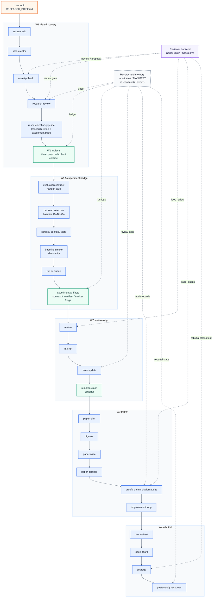
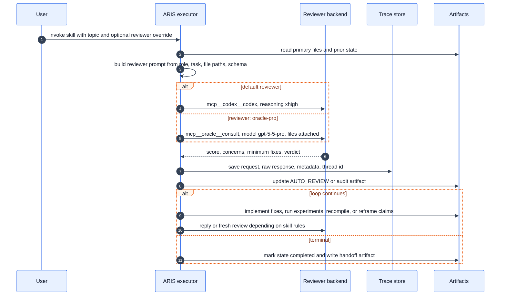

https://github.com/BeenLi/Auto-claude-code-research-in-sleep/blob/myMain/docs/WORKFLOW_WANLI.md
本文档把当前仓库的 ARIS 工作流展开到 skill、reviewer、状态文件和中间产物级别。
## 总览
**Workflow 1 -- Idea Discovery** (`/idea-discovery "topic"`): `research-lit` -> `idea-creator` -> `novelty-check` -> `research-review` -> `research-refine` -> `experiment-plan`

**Workflow 1.5 -- Experiment Bridge** (`/experiment-bridge`): Reads `refine-logs/EXPERIMENT_PLAN.md` -> implements code -> deploys experiments -> collects initial results in `EXPERIMENT_LOG.md`

**Workflow 2 -- Auto Review Loop** (`/auto-review-loop "scope"`): Up to 4 rounds: external LLM review -> identify weaknesses -> agent implements fixes -> re-review until score >= 6/10

**Workflow 3 -- Paper Writing** (`/paper-writing "NARRATIVE_REPORT.md"`): `paper-plan` -> `paper-figure` -> `paper-write` -> `paper-compile` -> `auto-paper-improvement-loop`

**Workflow 4 -- Rebuttal** (`/rebuttal "paper/ + reviews"`): Parses external reviews -> enforces coverage and grounding -> drafts text-only rebuttal


- reviewer routing：默认 Codex MCP xhigh，显式 `-- reviewer: oracle-pro` 才走 Oracle GPT-5.5 Pro。
- reviewer trace：每次 reviewer/critique 调用应写 `.aris/traces/<skill>/<UTC-date>_runNN/`。
- 状态恢复：`refine-logs/REFINE_STATE.json`、`review-stage/REVIEW_STATE.json`、`rebuttal/REBUTTAL_STATE.md`。
- 产物追踪：`MANIFEST.md`、timestamped artifact、latest copy。
- 横向记忆与优化：`research-wiki`、`.aris/meta/events.jsonl`、`meta-optimize`。

## End-to-End Diagram

图源文件：

- `figures/aris-workflow-overview.mmd`
- `figures/aris-workflow-overview.md`



## Reviewer Interaction Diagram

图源文件：

- `figures/aris-reviewer-interaction.mmd`
- `figures/aris-reviewer-interaction.md`



## Workflow Details

### Workflow 1: Idea Discovery

Command:

```bash
/idea-discovery "topic"
```

Actual chain:

```text
research-lit -> idea-creator -> novelty-check -> research-review -> research-refine-pipeline
```


`research-refine-pipeline` is the canonical outer step for the Workflow 1 tail. Internally it first stabilizes the method through `research-refine`, then turns the stable proposal into a claim-driven experiment roadmap through `experiment-plan`. 
Lite mode is the exception: **if reviewer score is below 6 or the evaluation handoff is unclear** (==这里reviewer的分数是如何评的？==), Workflow 1 may run only `/research-refine`, skip `/experiment-plan`, and record the remaining risk instead of producing a ready Workflow 1.5 handoff.

Inputs:

- **User topic** or `RESEARCH_BRIEF.md`.
- Optional reference paper via `REF_PAPER`; this writes `idea-stage/REF_PAPER_SUMMARY.md` before the literature pass.
- Existing `research-wiki/` if initialized.
- Local papers, Zotero, web/arXiv/Semantic Scholar depending on selected sources.
- Research Domain from `AGENTS.md`: This ARIS instance is configured for **Computer Architecture / AI Infrastructure for LLM** research with a hardware-leaning systems focus.

Controls and limits:

- `MAX_HANDOFF_IDEAS = 6`: write evaluation handoff plans for at most six strong ideas.
- `MAX_READY_FOR_WORKFLOW_1_5 = 3`: mark at most three ideas as immediate Workflow 1.5 candidates.
- `AUTO_PROCEED = true`: proceed with the best option at checkpoints unless the user overrides.
- `COMPACT = false`: when enabled, write a lean `idea-stage/IDEA_CANDIDATES.md` for recovery and downstream handoff.
- `REF_PAPER = false`: when set, summarize the reference paper and use it as context for literature and idea generation.
- `REVIEWER_MODEL = gpt-5.5`: reviewer model passed to review/refine sub-skills via Codex subagent/Codex MCP.
- `OUTPUT_DIR = idea-stage/`: all idea-stage outputs are written under this directory. (由于workflow1有多个SKILL，需要具体看是哪个SKILLS产出了文件，就看那个SKILLS中约束的OUTPUT_DIR为准)
- `ARXIV_DOWNLOAD = false`: default metadata-only; when true, Phase 1 downloads top relevant arXiv PDFs.

Important outputs:

- `idea-stage/LITERATURE_REVIEW.md` and timestamped copy.
- `idea-stage/IDEA_REPORT.md` and timestamped copy.
- `idea-stage/IDEA_CANDIDATES.md` and timestamped copy.
- `refine-logs/FINAL_PROPOSAL.md`.
- `refine-logs/REVIEW_SUMMARY.md`, `refine-logs/score-history.md`, `refine-logs/round-*.md`.
- `refine-logs/EXPERIMENT_PLAN.md`.
- `refine-logs/EXPERIMENT_TRACKER.md`.
- `refine-logs/PIPELINE_SUMMARY.md`.
- `idea-stage/docs/research_contract.md`, refreshed after the selected idea has proposal and plan outputs.
- `MANIFEST.md` rows for every durable artifact.
- Optional `research-wiki/` updates.
- Reviewer traces under `.aris/traces/` for `research-review`, `research-refine`, novelty or idea critiques.
#### Workflow 1 Sub-Skill Details

Compact dataflow:

```text
topic / RESEARCH_BRIEF.md / RefPaper
-> idea-stage/LITERATURE_REVIEW.md / Landscape Pack
-> idea-stage/IDEA_REPORT.md / evaluation_handoff_plan
-> Novelty Check Report
-> research-review feedback
-> refine-logs/FINAL_PROPOSAL.md / refine-logs/EXPERIMENT_PLAN.md / idea-stage/docs/research_contract.md
```

`/research-lit` turns the topic into a landscape and evaluation canon.

- Inputs: user topic or `RESEARCH_BRIEF.md`, prior `idea-stage/LITERATURE_REVIEW.md` if any, optional `research-wiki/`, Zotero, Obsidian notes, local paper library, web/arXiv/Semantic Scholar/OpenAlex/Gemini sources depending on availability and source selection.
- Process: audit source availability, infer the AI infrastructure layer, search primary and adjacent literature, analyze papers, synthesize mechanism clusters and structural gaps.
- Outputs: `idea-stage/LITERATURE_REVIEW_{YYYYMMDD_HHmmssZ}.md`, latest copy `idea-stage/LITERATURE_REVIEW.md`, optional downloaded PDFs or wiki updates, and `MANIFEST.md` rows.
- Handoff: Section 5 `Landscape Pack` is the machine-readable contract for `/idea-creator`; it must preserve `Evaluation Canon`, `Core Baseline Candidates`, simulator/prototype readiness, and `Gap Seeds`.
- Stop or degrade: missing sources are recorded in Source Audit and the skill continues with available sources; software-only topics without concrete hardware bottlenecks should be marked out-of-scope unless explicitly requested.

`/idea-creator` turns the landscape into ranked, evaluable ideas.

- Inputs: `idea-stage/LITERATURE_REVIEW.md`, its `Landscape Pack`, optional `idea-stage/REF_PAPER_SUMMARY.md`, optional `research-wiki/` query pack, and domain constraints.
- Process: load prior memory, generate 8-12 ideas, filter by architecture/systems relevance, extract evaluation canon mappings, run first-pass ranking, and prepare deeper validation for top ideas.
- Outputs: `idea-stage/IDEA_REPORT_{YYYYMMDD_HHmmssZ}.md`, latest copy `idea-stage/IDEA_REPORT.md`, optional `idea-stage/IDEA_CANDIDATES.md` in compact mode, wiki idea pages when enabled, and `MANIFEST.md` rows.
- Handoff: writes `evaluation_handoff_plan` for the top 4-6 ideas and marks at most 2-3 immediate Workflow 1.5 candidates with `handoff_to_workflow_1_5`.
- Stop or degrade: Workflow 1 does not run pilots or baseline reproduction; unclear platform/workload/baseline paths become `needs_canon_clarification` or `designed_not_run`, not fake readiness.

`/novelty-check` tests whether the selected idea has a defensible technical delta.

- Inputs: top idea description, method shape, core technical claims, and closest papers already known from literature review.
- Process: extract 3-5 novelty-bearing claims, search each claim across recent literature and major architecture/systems venues, read close abstracts/related-work sections, and ask a reviewer model for cross-check.
- Outputs: a structured `Novelty Check Report` with proposed method, core claims, closest prior work, overall novelty score, recommendation, risk, and suggested positioning.
- Handoff: updates the idea report or selection rationale with closest prior work and differentiators before `/research-review`.
- Stop or degrade: `ABANDON` kills or demotes the idea; `PROCEED WITH CAUTION` requires the next review/refinement step to explicitly address overlap risk.

`/research-review` supplies the external reviewer gate before method refinement.

- Inputs: selected idea, evaluation handoff plan, novelty evidence, proposal or narrative files if present, experiment context if any, and known weaknesses.
- Process: gather research context, send an xhigh senior architecture/systems reviewer prompt, iterate only on actionable questions, and converge on claim/evidence requirements.
- Outputs: reviewer score or verdict, logical gaps, missing experiments, narrative weaknesses, minimum viable fixes, claims matrix, and prioritized TODOs when requested.
- Handoff: provides the review summary and concrete objections that `/research-refine-pipeline` must either resolve or preserve as known risks.
- Stop or degrade: if reviewer feedback exposes an unstable thesis or unclear evaluation target, Workflow 1 should use lite mode or return to idea/canon clarification instead of forcing an experiment plan.

`/research-refine-pipeline` is the canonical Workflow 1 tail.

- Inputs: reviewed selected idea, novelty result, review feedback, evaluation handoff plan, constraints, target venue, and existing `refine-logs/` files if resuming.
- Process: triage whether the current proposal is stale, run or reuse `research-refine`, run the planning gate, run `experiment-plan`, write an integration summary, and refresh the research contract.
- Outputs: `refine-logs/FINAL_PROPOSAL.md`, `refine-logs/REVIEW_SUMMARY.md`, `refine-logs/REFINEMENT_REPORT.md`, `refine-logs/EXPERIMENT_PLAN.md`, `refine-logs/EXPERIMENT_TRACKER.md`, `refine-logs/PIPELINE_SUMMARY.md`, and refreshed `idea-stage/docs/research_contract.md`.
- Handoff: this package is the input to Workflow 1.5; `EXPERIMENT_PLAN.md` owns execution details, while `research_contract.md` owns active idea and claim boundaries.
- Stop or degrade: if the method remains `REVISE`, planning may continue only when weaknesses are explicit; otherwise tighten the proposal before producing a full experiment roadmap.

Wrapper boundary:

- `research-refine` owns the Problem Anchor, method thesis, contribution focus, review rounds, drift checks, final proposal, and refinement history.
- `experiment-plan` owns the Claim Map, paper storyline, Evaluation Inputs, experiment blocks, run order, validation budget, tracker, and Workflow 1.5 handoff fields.
- `research-refine-pipeline` coordinates the two and writes the integrated summary; it does not make `research-refine` or `experiment-plan` obsolete.

#### Workflow 1 Output Templates

These are compact template summaries for auditing output shape. The detailed canonical templates live in the child skill files.

`idea-stage/LITERATURE_REVIEW.md`:

- Header: generation date, skill name, original topic query.
- Section 0 `Source Audit`: source, status, action taken or fallback notes.
- Section 1 `Paper Table`: paper, venue, year, method, key result, relevance, source.
- Section 1b `Cross-domain References`: adjacent-domain papers and transferable insights.
- Section 2 `Landscape Map`: 3-5 paragraphs by sub-direction cluster.
- Section 3 `Structural Gaps`: cross-domain transfer, contradictions, untested assumptions, unexplored regimes, unasked questions.
- Section 4 `Competitive Landscape`: top competing papers and positioning notes.
- Section 5 `Landscape Pack`: topic scope, bottleneck evidence, mechanism clusters, `Evaluation Canon`, `Core Baseline Candidates`, simulator/prototype readiness, `Gap Seeds`.

`idea-stage/IDEA_REPORT.md`:

- Header: direction, UTC generation time, generated/survived/handoff/recommended counts.
- `Landscape Summary`: concise synthesis from the literature review.
- `Recommended Ideas`: ranked ideas with idea shape, merit, `core_baseline`, `canon_mapping`, metrics, validation style, feasibility fields, platform path, blocker, reviewer objection, and rationale.
- `Eliminated Ideas`: idea, category, reason, revisit condition.
- `Deferred / Designed-Not-Run Ideas`: why deferred and what must become available.
- `Evaluation Handoff Summary`: compact table of ranking, feasibility, baseline, canon, metrics, validation style, handoff status, blocker.
- `Suggested Execution Order` and `Next Steps`: selected idea goes to `/research-refine-pipeline`, then Workflow 1.5 creates `EVALUATION_CONTRACT.md`.

`Novelty Check Report`:

- `Proposed Method`: 1-2 sentence method description.
- `Core Claims`: each claim with novelty level and closest paper.
- `Closest Prior Work`: paper, year, venue, overlap, key difference.
- `Overall Novelty Assessment`: score, recommendation, key differentiator, reviewer risk.
- `Suggested Positioning`: how to frame the contribution without overclaiming novelty.

`refine-logs/REVIEW_SUMMARY.md`:

- Header: problem, initial approach, date, rounds, final score, final verdict.
- `Problem Anchor`: the invariant problem statement used across rounds.
- `Round-by-Round Resolution Log`: reviewer concerns, simplifications or modernization, solved status, remaining risk.
- `Overall Evolution`: how the method became concrete, focused, and less overbuilt.
- `Final Status`: anchor, focus, platform status, strongest parts, remaining weaknesses.

`refine-logs/FINAL_PROPOSAL.md`:

- Clean final proposal only.
- It should not include round history, raw reviewer text, or review chatter.
- If the verdict is not `READY`, it still holds the best current proposal version with limitations expressed honestly.

`refine-logs/REFINEMENT_REPORT.md`:

- Header: problem, initial approach, date, rounds, final score, final verdict.
- `Output Files`: links to review summary and final proposal.
- `Score Evolution`: round-by-round rubric table.
- `Round-by-Round Review Record`: concern, change, result.
- `Final Proposal Snapshot`: short thesis summary pointing to `FINAL_PROPOSAL.md`.
- `Method Evolution Highlights`, `Pushback / Drift Log`, `Remaining Weaknesses`, and optional raw reviewer response details.

`refine-logs/EXPERIMENT_PLAN.md`:

- Header: problem, method thesis, date.
- `Claim Map`: claim, why it matters, minimum convincing evidence, linked blocks.
- `Paper Storyline`: main-paper proof, appendix support, intentionally cut experiments.
- `Evaluation Inputs`: `core_baseline`, `canon_mapping`, metrics, validation style, clarity, feasibility, baseline reproducibility, environment access, adapter cost, pilot runtime cost.
- `Experiment Blocks`: claim tested, purpose, referenced Evaluation Inputs, workload/configuration, compared systems, decisive metrics, setup, success criterion, failure interpretation, table/figure target, priority.
- `Run Order and Milestones`, `Validation Budget`, `Risks and Mitigations`, `Final Checklist`.

`refine-logs/EXPERIMENT_TRACKER.md`:

- Compact execution table with `Run ID`, milestone, purpose, system/variant, split or workload, metrics, priority, status, notes.
- It is execution-oriented and should not duplicate the full experiment-plan prose.

`refine-logs/PIPELINE_SUMMARY.md`:

- Header: problem, final method thesis, final verdict, date.
- `Final Deliverables`: proposal, review summary, experiment plan, tracker.
- `Contribution Snapshot`: dominant contribution, optional supporting contribution, intentionally rejected complexity.
- `Must-Prove Claims`, `First Runs to Launch`, `Main Risks`, `Next Action`.

`idea-stage/docs/research_contract.md`:

- Selected idea, intended claims, evidence boundary, key decisions, and current research gate.
- It points to `refine-logs/EXPERIMENT_PLAN.md` for execution details and to result logs for factual evidence.
- It must not copy full experiment blocks, raw logs, ordinary code TODOs, or unsupported claims phrased as paper-ready evidence.

### Workflow 1.5: Experiment Bridge

Command:

```bash
/experiment-bridge
```

Inputs:

- `refine-logs/EXPERIMENT_PLAN.md`.
- Optional `refine-logs/EXPERIMENT_TRACKER.md`.
- Optional `refine-logs/FINAL_PROPOSAL.md`.
- `idea-stage/IDEA_REPORT.md` and `idea-stage/docs/research_contract.md` when available.
- Evaluation handoff fields from Workflow 1: `core_baseline`, `canon_mapping`, `metrics`, `target_validation_style`, feasibility, environment access, adapter cost, pilot runtime cost, and `handoff_to_workflow_1_5`.

Internal stages:

1. Parse claims, claim boundaries, baselines, ablations, metrics, resource needs, and Workflow 1 evaluation handoff fields.
2. Evaluate the Workflow 1 -> 1.5 handoff gate before implementation.
3. Write `refine-logs/EVALUATION_CONTRACT.md` first.
4. Map `handoff_to_workflow_1_5` to `idea_execution_readiness`.
5. Select the evaluation backend from `core_baseline` and `canon_mapping`; do not use a global fixed simulator default.
6. Apply the baseline reproduction Go/No-Go rule.
7. Run baseline smoke first when required.
8. Write or update `refine-logs/EXPERIMENT_MANIFEST.yaml`.
9. Generate or reuse scripts, configs, tests, simulator glue, and result directories for the selected backend.
10. Run the smallest idea sanity/smoke case.
11. Review code/config before expensive runs.
12. Route execution:
   - small one-off job -> `/run-experiment`;
   - grid, many seeds, or phase dependencies -> `/experiment-queue`.
13. Collect logs/results into `refine-logs/EXPERIMENT_LOG.md` or project-specific experiment result files.

Important outputs:

- `refine-logs/EVALUATION_CONTRACT.md`.
- `refine-logs/EXPERIMENT_MANIFEST.yaml`.
- `refine-logs/EXPERIMENT_TRACKER.md`.
- `refine-logs/EXPERIMENT_LOG.md`.
- Experiment code/configs/tests, for this repo currently under `experiments/rx-expansion/` and `tests/`.
- Result files such as `.json`, `.csv`, reports, plots, simulator logs.

Missing detail in the original diagram: `experiment-bridge` is not only "implement\_code"; it must lock the evaluation contract before implementation, preserve claim boundaries, prove baseline status honestly, run sanity checks, and produce machine-readable evidence for later audits.

### Workflow 2: Auto Review Loop

Command:

```bash
/auto-review-loop "scope"
```

Inputs:

- `refine-logs/EXPERIMENT_PLAN.md`.
- Experiment results and logs.
- Implementation code.
- `review-stage/AUTO_REVIEW.md` and `review-stage/REVIEW_STATE.json` if resuming.
- Optional `findings.md` / `EXPERIMENT_LOG.md` when compact mode is enabled.

Reviewer modes:

- `medium`: Codex MCP xhigh review.
- `hard`: reviewer memory plus debate protocol.
- `nightmare`: reviewer reads repo directly and verifies code/results.
- `-- reviewer: oracle-pro`: one-shot or final stress review through Oracle GPT-5.5 Pro when explicitly requested.

Loop details:

```text
Phase A: reviewer reads artifacts and scores work
Phase B: executor parses score, verdict, critical weaknesses
Phase B.5: reviewer memory update, hard/nightmare only
Phase B.6: debate protocol, hard/nightmare only
Human checkpoint: optional
Phase C: implement fixes or launch experiments
Phase D: wait for results
Phase E: document round and update REVIEW_STATE
Repeat until score threshold or max rounds
```

Important outputs:

- `review-stage/AUTO_REVIEW.md`.
- `review-stage/AUTO_REVIEW_<UTC timestamp>.md`.
- `review-stage/REVIEW_STATE.json`.
- `review-stage/REVIEW_STATE_<UTC timestamp>.json`.
- Optional `CLAIMS_FROM_RESULTS.md` from `/result-to-claim`.
- Optional updates to `research-wiki/ideas/*`, `research-wiki/claims/*`, and graph edges.
- `.aris/traces/auto-review-loop/...` or `.aris/traces/research-review/...`.

Missing detail in the original diagram: Workflow 2 is not just review/fix. It owns reviewer memory, debate, state recovery, raw response preservation, Feishu notifications when configured, and the bridge to claims for paper writing.

### Workflow 3: Paper Writing

Command:

```bash
/paper-writing "NARRATIVE_REPORT.md"
```

Inputs:

- `NARRATIVE_REPORT.md` or `STORY.md`.
- `CLAIMS_FROM_RESULTS.md` if generated.
- `review-stage/AUTO_REVIEW.md`.
- `idea-stage/IDEA_REPORT.md`.
- Experiment result files, figure/table data, and known limitations.
- Optional existing `PAPER_PLAN.md` to skip planning.

Detailed chain:

```text
paper-plan -> paper-figure -> figure-spec/paper-illustration/mermaid-diagram
-> paper-write -> paper-compile
-> proof-checker if theory
-> paper-claim-audit
-> auto-paper-improvement-loop
-> final paper-claim-audit
-> citation-audit
-> tools/verify_paper_audits.sh
-> final report
```

Important outputs:

- `PAPER_PLAN.md`.
- `figures/` scripts, plots, tables, specs, SVG/PDF/PNG.
- `paper/main.tex`.
- `paper/sections/*.tex`.
- `paper/references.bib`.
- `paper/main.pdf`.
- `PAPER_IMPROVEMENT_LOG.md`.
- `paper/PROOF_AUDIT.{md,json}` when applicable.
- `paper/PAPER_CLAIM_AUDIT.{md,json}`.
- `paper/CITATION_AUDIT.{md,json}`.
- `paper/.aris/audit-verifier-report.json`.
- Final paper-writing report.

Missing detail in the original diagram: Workflow 3 has multiple assurance gates. A paper can compile and still fail submission readiness if claim, proof, or citation audits fail.

### Workflow 4: Rebuttal

Command:

```bash
/rebuttal "paper/ + reviews" -- venue: ICML
```

Inputs:

- Paper source or PDF.
- Raw external reviews.
- Venue rules, length limit, response mode.
- Current stage: initial rebuttal or follow-up.

Outputs:

- `rebuttal/REVIEWS_RAW.md`.
- `rebuttal/ISSUE_BOARD.md`.
- `rebuttal/STRATEGY_PLAN.md`.
- `rebuttal/EVIDENCE_LEDGER.md`.
- `rebuttal/REBUTTAL_DRAFT_rich.md`.
- `rebuttal/PASTE_READY.txt`.
- `rebuttal/REVISION_PLAN.md`.
- `rebuttal/FOLLOWUP_LOG.md` for later rounds.
- `rebuttal/REBUTTAL_STATE.md`.

Safety gates:

- provenance gate: every factual statement has a source.
- commitment gate: every promise is approved or marked future work.
- coverage gate: every reviewer concern is answered, deferred, or needs user input.

Missing detail in the original diagram: rebuttal is a first-class workflow, not an afterthought after paper writing.

## Skill Input / Output Matrix

| Skill                          | Main input                                           | Reviewer interaction                          | Main output                                                   |
| ------------------------------ | ---------------------------------------------------- | --------------------------------------------- | ------------------------------------------------------------- |
| `/research-pipeline`           | broad topic, optional `RESEARCH_BRIEF.md`            | delegates to child workflow reviewers         | `NARRATIVE_REPORT.md`, pipeline report, optional paper        |
| `/idea-discovery`              | topic or brief                                       | delegates to idea/review/refine-pipeline skills | `idea-stage/IDEA_REPORT.md`, `idea-stage/IDEA_CANDIDATES.md`, `research_contract.md` |
| `/research-lit`                | topic, sources, optional wiki                        | optional deep reviewer for synthesis          | topic-scoped literature report, wiki paper ingest             |
| `/idea-creator`                | research-lit output, wiki query pack, domain profile | external idea critique when configured        | ranked ideas, pilot table, `IDEA_REPORT.md`                   |
| `/novelty-check`               | top idea and related work                            | reviewer/critic call, traced                  | novelty risk report, prior-work objections                    |
| `/research-review`             | proposal, plan, paper, results, file paths           | Codex xhigh or Oracle Pro                     | review report, score, Go/No-Go, traces                        |
| `/research-refine`             | selected idea and grounding material                 | multi-round proposal review                   | `FINAL_PROPOSAL.md`, `REVIEW_SUMMARY.md`, `REFINE_STATE.json` |
| `/experiment-plan`             | refined proposal                                     | may use reviewer feedback indirectly          | `EXPERIMENT_PLAN.md`, tracker-ready milestones                |
| `/research-refine-pipeline`    | reviewed selected idea and evaluation handoff        | composes refine review and experiment planning | `FINAL_PROPOSAL.md`, `EXPERIMENT_PLAN.md`, `PIPELINE_SUMMARY.md` |
| `/experiment-bridge`           | `EXPERIMENT_PLAN.md`, handoff fields, research contract | code/config review before expensive runs      | evaluation contract, backend manifest, tracker, logs/results  |
| `/run-experiment`              | one run spec                                         | normally no reviewer                          | single run output, logs, status                               |
| `/experiment-queue`            | job grid or phase manifest                           | normally no reviewer                          | queue state, wave results, retry/stuck status                 |
| `/auto-review-loop`            | code/results/claims/scope                            | core iterative reviewer loop                  | `AUTO_REVIEW.md`, `REVIEW_STATE.json`, optional claims        |
| `/result-to-claim`             | results and review conclusions                       | Codex judge of claim support                  | `CLAIMS_FROM_RESULTS.md`, wiki claim updates                  |
| `/paper-writing`               | `NARRATIVE_REPORT.md`, claims, review history        | delegates to plan/audit/improvement reviewers | full paper directory, PDF, final report                       |
| `/paper-plan`                  | narrative, claims, review history                    | outline review via reviewer model             | `PAPER_PLAN.md`                                               |
| `/paper-figure`                | paper plan and result data                           | figure quality review                         | reproducible figures, tables, LaTeX snippets                  |
| `/figure-spec`                 | architecture/workflow figure request                 | no external reviewer by default               | deterministic SVG/PDF/spec JSON                               |
| `/paper-illustration`          | method description                                   | image generation/review path                  | AI-generated illustration assets                              |
| `/mermaid-diagram`             | diagram request                                      | syntax/visual verification                    | `.mmd`, `.md`, rendered image                                 |
| `/paper-write`                 | `PAPER_PLAN.md`                                      | section-level quality review                  | LaTeX source and bibliography                                 |
| `/paper-compile`               | `paper/`                                             | no reviewer by default                        | `paper/main.pdf`, compile fixes                               |
| `/proof-checker`               | paper proofs                                         | rigorous reviewer/proof critic                | `PROOF_AUDIT.{md,json}`                                       |
| `/paper-claim-audit`           | paper plus raw result files                          | zero-context reviewer                         | `PAPER_CLAIM_AUDIT.{md,json}`                                 |
| `/citation-audit`              | paper bibliography and citations                     | web/DBLP/arXiv-aware reviewer                 | `CITATION_AUDIT.{md,json}`                                    |
| `/auto-paper-improvement-loop` | compiled paper                                       | multi-round paper reviewer                    | improved PDFs, `PAPER_IMPROVEMENT_LOG.md`                     |
| `/rebuttal`                    | paper, raw reviews, venue rules                      | stress-test reviewer and follow-up continuity | rebuttal directory and paste-ready response                   |
| `/research-wiki`               | papers, ideas, experiments, claims                   | no reviewer by default                        | persistent memory pages, graph edges, query pack              |
| `/meta-optimize`               | `.aris/meta/events.jsonl`, traces                    | reviewer-gated harness optimization           | proposed skill/routing improvements                           |

## Reviewer and Trace Contract

Default reviewer behavior:

- All review calls default to Codex MCP with xhigh reasoning.
- `-- reviewer: oracle-pro` is explicit opt-in and routes to Oracle GPT-5.5 Pro when available.
- Browser-mode Oracle is acceptable for one-shot reviews, but not ideal for tight multi-round loops.
- Reviewer independence means the executor should pass primary file paths and tasks, not pre-digested summaries, whenever the reviewer can read files directly.

Trace files:

```text
.aris/traces/<skill>/<UTC-date>_runNN/
  run.meta.json
  001-<purpose>.request.json
  001-<purpose>.response.md
  001-<purpose>.meta.json
```

Trace metadata should preserve:

- skill and purpose;
- UTC timestamp;
- tool name, model, thread id;
- prompt snapshot;
- raw reviewer response.

## Artifact and State Map

```text
project/
  AGENTS.md                         # domain profile, current pipeline state
  MANIFEST.md                       # output ledger
  .aris/
    meta/events.jsonl               # hook/meta events
    traces/                         # reviewer call evidence
  research-wiki/                    # persistent papers/ideas/claims/experiments
  idea-stage/
    IDEA_REPORT.md
    IDEA_CANDIDATES.md
    docs/research_contract.md
  refine-logs/
    FINAL_PROPOSAL.md
    REVIEW_SUMMARY.md
    REFINE_STATE.json
    EXPERIMENT_PLAN.md
    EVALUATION_CONTRACT.md
    EXPERIMENT_MANIFEST.yaml
    EXPERIMENT_TRACKER.md
    EXPERIMENT_LOG.md
    PIPELINE_SUMMARY.md
  experiments/
    <project-specific code, configs, results>
  review-stage/
    AUTO_REVIEW.md
    REVIEW_STATE.json
  figures/
    scripts, specs, plots, tables, mermaid diagrams
  paper/
    main.tex
    sections/
    references.bib
    main.pdf
    PROOF_AUDIT.{md,json}
    PAPER_CLAIM_AUDIT.{md,json}
    CITATION_AUDIT.{md,json}
  rebuttal/
    REVIEWS_RAW.md
    ISSUE_BOARD.md
    STRATEGY_PLAN.md
    REBUTTAL_DRAFT_rich.md
    PASTE_READY.txt
    REVISION_PLAN.md
    REBUTTAL_STATE.md
```

## Practical Checklist

Before calling a workflow "complete", check:

- Did every durable artifact get a `MANIFEST.md` row?
- Did reviewer calls write `.aris/traces/...`?
- Did state files mark `"status": "completed"` when the loop ended?
- Did Workflow 2 generate or explicitly skip `CLAIMS_FROM_RESULTS.md`?
- Did Workflow 3 run proof, claim, and citation audits when detectors matched?
- Did `tools/verify_paper_audits.sh` pass before declaring submission readiness?
- Did `AGENTS.md` Pipeline Status get updated on stage transition or handoff?


# skills同步
> 参考：tools/SKILL_SYNC_AND_INSTALL.md

```bash
# 1. Edit the source skill

$EDITOR skills/<skill-name>/SKILL.md
  

# 2. Sync the Codex mirror

## step1 确认当前是否有改动没有同步
python3 tools/sync_codex_skill_mirror.py --dry-run 

## step2 进行同步
python3 tools/sync_codex_skill_mirror.py --apply

## step3 再次检查是否同步干净
python3 tools/sync_codex_skill_mirror.py --dry-run


# 3. ## Unified Project Install

bash tools/install_aris.sh --target claude
bash tools/install_aris.sh /path/to/target/repo --target claude


bash tools/install_aris.sh --target codex 
bash tools/install_aris.sh /path/to/target/repo --target codex


bash tools/install_aris.sh --target gemini 
bash tools/install_aris.sh /path/to/target/repo --target gemini
```
For Codex reviewer overlays, keep the overlay flag when reconciling:

```bash
bash tools/install_aris.sh --target codex --with-claude-review-overlay

bash tools/install_aris.sh --target codex --with-gemini-review-overlay
```