# Research Wiki 架构与数据流说明

本文档说明 ARIS 当前 Research Wiki 的架构、数据模型、核心数据流和维护边界。它面向维护者、贡献者和需要排查 wiki 集成问题的使用者。

当前实现以 `tools/research_wiki.py` 为唯一业务 helper；`skills/research-wiki/SKILL.md` 负责描述用户可见命令和工作流约定；每个项目自己的 `research-wiki/` 目录负责保存持久化知识。

## 1. 系统定位

Research Wiki 是 ARIS 的项目级持久研究记忆。它把论文、idea、实验、claim、gap 以及它们之间的 typed relationship 保存为普通文件，供后续 `/idea-creator`、`/research-lit`、`/result-to-claim` 等流程复用。

它解决的问题不是“临时总结一次文献”，而是让研究上下文可积累、可回填、可检查：

- 论文读过后沉淀到 `papers/`
- idea 被提出、失败或验证后沉淀到 `ideas/`
- 实验和 claim 关系沉淀到 `experiments/`、`claims/` 和 `graph/edges.jsonl`
- `/idea-creator` 通过 `query_pack.md` 读取压缩后的项目记忆
- `lint` 和 `verify_wiki_coverage.sh` 用于发现结构漂移或集成漏写

## 2. 总体架构

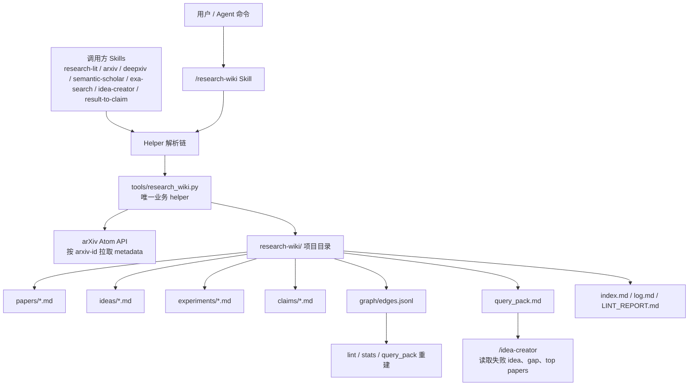

核心边界：

| 层 | 职责 | 主要文件 |
|---|---|---|
| Skill 层 | 用户可见命令说明、调用时机、helper 解析约定 | `skills/research-wiki/SKILL.md` |
| 调用方 skill | 在各自流程结束时触发 wiki 副作用，例如 ingest 论文、写 idea、更新 claim | `skills/research-lit/SKILL.md` 等 |
| Helper CLI | 真实业务逻辑：初始化、论文 ingest、边写入、索引重建、query pack、update、lint、stats | `tools/research_wiki.py` |
| Wiki 存储 | 项目内 Markdown 和 JSONL 文件，作为持久化知识库 | `research-wiki/` |
| 诊断脚本 | 检查已读论文和 wiki 覆盖关系 | `tools/verify_wiki_coverage.sh` |

## 3. Helper 解析链

所有会触碰 wiki 的 skill 都必须先解析 `research_wiki.py` 的实际位置。原因是 ARIS 可以运行在三种安装形态下：

| 优先级 | 路径 | 典型场景 |
|---|---|---|
| 1 | `.aris/tools/research_wiki.py` | 用户项目通过 `install_aris.sh` 安装后形成的 symlink |
| 2 | `tools/research_wiki.py` | 在 ARIS 仓库内开发，或用户手动复制 helper |
| 3 | `$ARIS_REPO/tools/research_wiki.py` | 通过环境变量或 `.aris/installed-skills.txt` 定位 ARIS 源仓库 |

解析逻辑由 `skills/shared-references/wiki-helper-resolution.md` 维护。`/research-wiki` 本身找不到 helper 时 hard-fail；调用方 skill 找不到 helper 时 warn-and-skip，保证主任务输出仍然交付，只跳过 wiki 副作用。

## 4. 存储结构

初始化后，一个项目的 wiki 目录结构如下：

```text
research-wiki/
  index.md
  log.md
  gap_map.md
  query_pack.md
  LINT_REPORT.md              # lint 后生成
  papers/
    <slug>.md
  ideas/
    <idea_id>.md
  experiments/
    <exp_id>.md
  claims/
    <claim_id>.md
  graph/
    edges.jsonl
```

文件职责：

| 文件 / 目录 | 类型 | 说明 |
|---|---|---|
| `papers/*.md` | 主实体 | 每篇论文一页；当接入 Obsidian 时是 agent-facing 投影，不替代 Obsidian 全量论文笔记 |
| `ideas/*.md` | 主实体 | 每个研究 idea 一页，记录 stage、outcome、失败经验等 |
| `experiments/*.md` | 主实体 | 每个实验一页，记录实验设置和结果 |
| `claims/*.md` | 主实体 | 每个可验证 claim 一页，记录 status 和证据 |
| `graph/edges.jsonl` | 关系图 | 每行一个 JSON edge，是 relationship 的唯一结构化来源 |
| `index.md` | 派生文件 | 从实体 frontmatter 生成的分类索引 |
| `query_pack.md` | 派生文件 | 给 `/idea-creator` 的压缩上下文，默认不超过 8000 字符 |
| `log.md` | 审计日志 | 每次 mutation 追加一条时间戳日志 |
| `gap_map.md` | 手工/流程维护 | 项目 gap 列表，使用稳定 gap ID |
| `LINT_REPORT.md` | 派生诊断 | `lint` 生成的健康检查报告 |

## 5. 数据模型

### 5.1 实体类型

| 实体 | 目录 | Node ID | 说明 |
|---|---|---|---|
| Paper | `papers/` | `paper:<slug>` | 论文或 preprint |
| Idea | `ideas/` | `idea:<id>` | 研究想法，可能处于 proposed、active、failed、positive 等状态 |
| Experiment | `experiments/` | `exp:<id>` | 具体实验运行和结果 |
| Claim | `claims/` | `claim:<id>` | 可验证科学主张 |
| Gap | `gap_map.md` | `gap:<id>` | 领域空白或待解决问题 |

### 5.2 Paper frontmatter

`ingest_paper` 与 `sync-obsidian` 生成的 paper 页面遵循固定 schema。Obsidian 是全量论文笔记的 source of truth；Wiki 只保存紧凑投影和 ARIS 项目局部笔记。

```yaml
type: paper
node_id: paper:<slug>
source: obsidian
obsidian_path: "001-input/PaperRead/PaperNotes/<note>.md"
title: "<full title>"
method_name: "<method>"
authors: ["First Author", "Second Author"]
year: 2025
venue: "arXiv"
external_ids:
  arxiv: "2501.12345"
  doi: null
  s2: null
zotero:
  item_id: null
  item_key: null
  collection: null
tags: ["tag1", "tag2"]
projection_updated: 2026-04-07T10:12:00Z
```

正文分为两个 marker 区：

- `OBSIDIAN PROJECTION`：由 helper 生成，可被 `sync-obsidian` 重写。
- `PROJECT NOTES`：保留 ARIS 项目手写笔记，sync 时尽量字节级保留。

当前 helper 解析的是一个轻量 YAML-like 子集，支持顶层 scalar、简单数组和一层嵌套字段。不要把它扩展成依赖完整 YAML 语义的通用解析器。

### 5.3 Relationship edge

`graph/edges.jsonl` 中每行是一个 relationship：

```json
{"from":"idea:001","to":"paper:vaswani2017_attention","type":"inspired_by","evidence":"Section 3 motivates the design.","added":"2026-05-12T00:00:00Z"}
```

支持的 edge type：

| Type | 方向 | 含义 |
|---|---|---|
| `extends` | paper -> paper | 后续工作扩展前作 |
| `contradicts` | paper -> paper 或 claim 相关 | 结果或结论冲突 |
| `addresses_gap` | paper/idea -> gap | 解决某个 gap |
| `inspired_by` | idea -> paper | idea 来源 |
| `tested_by` | idea/claim -> exp | 由实验测试 |
| `supports` | exp -> claim/idea | 实验支持 claim 或 idea |
| `invalidates` | exp -> claim/idea | 实验否定 claim 或 idea |
| `supersedes` | paper -> paper | 新工作替代旧工作 |

不变量：结构化关系以 `graph/edges.jsonl` 为准。页面里的 `## Connections` 是给人读的区域，当前 helper 不把它作为关系图来源。

## 6. 核心数据流

### 6.1 初始化

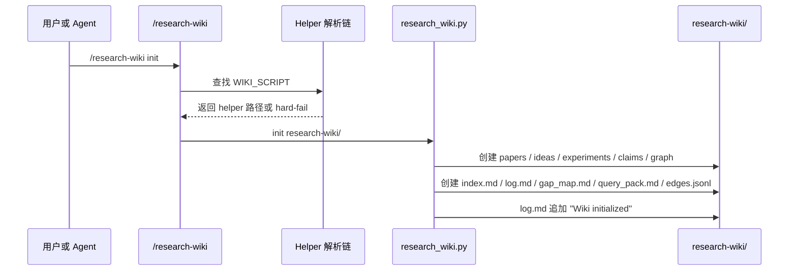

### 6.2 论文 ingest

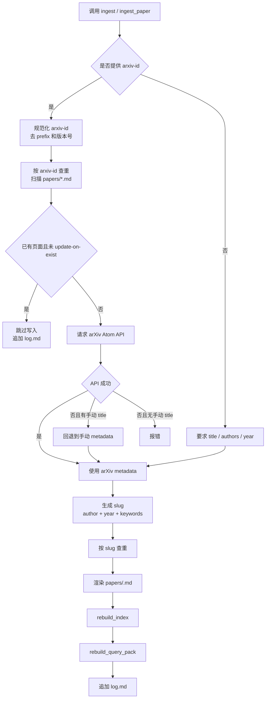

数据进入点：

- `/research-wiki ingest`
- `/research-wiki sync --arxiv-ids ...`
- paper-reading skills 的 wiki hook，例如 `/research-lit`、`/arxiv`、`/deepxiv`

输出：

- `papers/<slug>.md`
- `index.md`
- `query_pack.md`
- `log.md`

### 6.3 sync 回填

`sync` 是 ingest 的批处理包装，用于修复过去读过但没有写入 wiki 的论文。

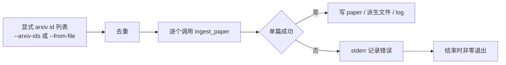

设计约束：`sync` 不扫描 session trace 猜测输入；调用者必须显式声明 arXiv IDs。这降低误回填和不可复现行为。

### 6.4 Obsidian PaperNotes sync

`sync-obsidian` 从 Obsidian PaperNotes 目录读取论文笔记，生成或更新 `papers/*.md` 的投影区。它不读取 concept notes，不写回 Obsidian，也不写 Zotero。

```bash
python3 "$WIKI_SCRIPT" sync-obsidian research-wiki/ \
  --paper-notes-dir "$HOME/Library/Mobile Documents/iCloud~md~obsidian/Documents/ob-career/001-input/PaperRead/PaperNotes" \
  --zotero-db "$HOME/Zotero/zotero.sqlite" \
  --dry-run \
  --report obsidian-sync-report.md
```

关键规则：

- 匹配默认只使用强 ID：Zotero item id/key、legacy Zotero key、DOI、arXiv id。
- normalized title 和 `method_name` 属于弱匹配，必须显式开启 `--match-loose`。
- `--limit N` 按 note mtime 降序选择最新 N 篇。
- Zotero 只读补齐缺失 metadata；Obsidian 非空字段优先，冲突只报告不覆盖。
- 旧 Wiki paper 没有 marker 时只在本次命中的页面上 lazy migration。

### 6.5 query_pack 生成

`query_pack.md` 是给 `/idea-creator` 的压缩上下文，不是完整 wiki 摘要。默认预算是 8000 字符。

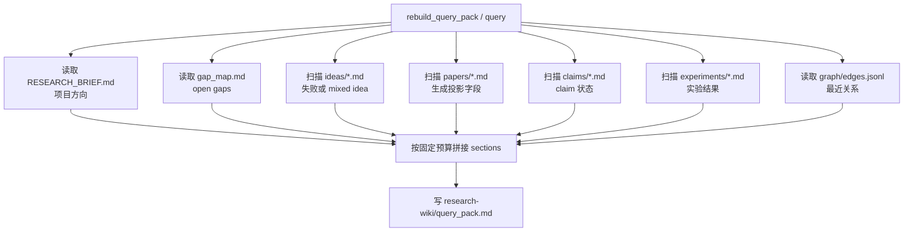

当前实现的 section 来源：

| Section | 来源 | 当前提取方式 |
|---|---|---|
| Project Direction | `RESEARCH_BRIEF.md` | 前 300 字符 |
| Open Gaps | `gap_map.md` | 前 1200 字符 |
| Failed Ideas | `ideas/*.md` | 匹配 `outcome: negative` 或 `outcome: mixed` |
| Key Papers | `papers/*.md` | 提取 `node_id`、`title`、Obsidian path、Agent Summary、Related Papers |
| Claims | `claims/*.md` | 提取 claim id、status、短正文摘要 |
| Experiments | `experiments/*.md` | 提取 experiment id、setup、result、linked claim/idea |
| Recent Relationships | `graph/edges.jsonl` | 最近 20 条 edge |

### 6.6 update

`update` 用于更新实体页面的顶层 frontmatter 字段。

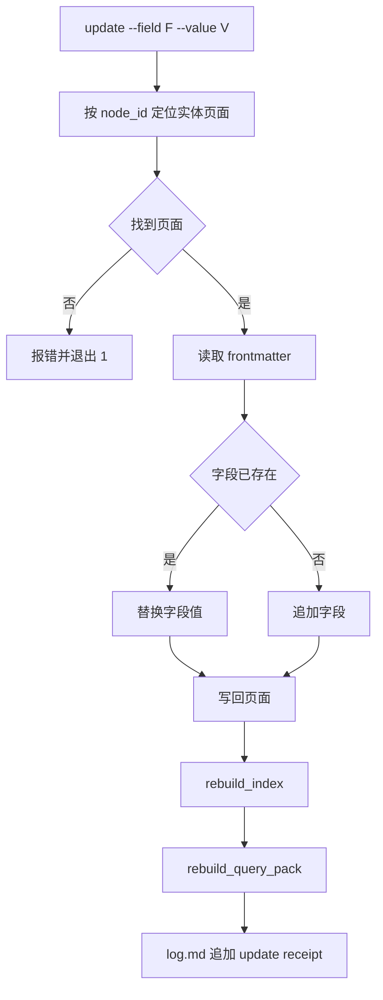

典型用途：

```bash
python3 "$WIKI_SCRIPT" update research-wiki/ idea:001 --field outcome --value negative
python3 "$WIKI_SCRIPT" update research-wiki/ claim:C1 --field status --value invalidated
```

### 6.7 add_edge

`add_edge` 只维护 `graph/edges.jsonl`：

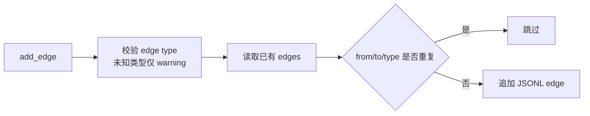

注意：当前 `add_edge` 不自动重建 `query_pack.md`。调用方如果希望新关系立刻进入 query context，需要在后续显式调用 `rebuild_query_pack` 或 `query`。

### 6.8 lint 健康检查

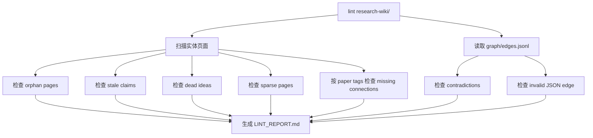

当前 lint 项：

| 检查项 | 触发条件 |
|---|---|
| Orphan Pages | 实体页面在 graph 中入度和出度均为 0 |
| Stale Claims | `claim:*` 的 `status: reported` 且 `added` 或 `updated` 超过 14 天 |
| Contradictions | 同一个 claim 同时有 `supports` 和 `invalidates` edge |
| Missing Connections | 两篇 paper 共享 2 个以上 tags，但没有显式 edge |
| Dead Ideas | `stage: proposed` 的 idea 没有测试或结果 edge |
| Sparse Pages | 页面中 3 个以上二级 section 为空或仅 TODO |
| Invalid Edges | `edges.jsonl` 中存在非法 JSON 行 |

## 7. 工作流集成

### 7.1 paper-reading skills -> wiki

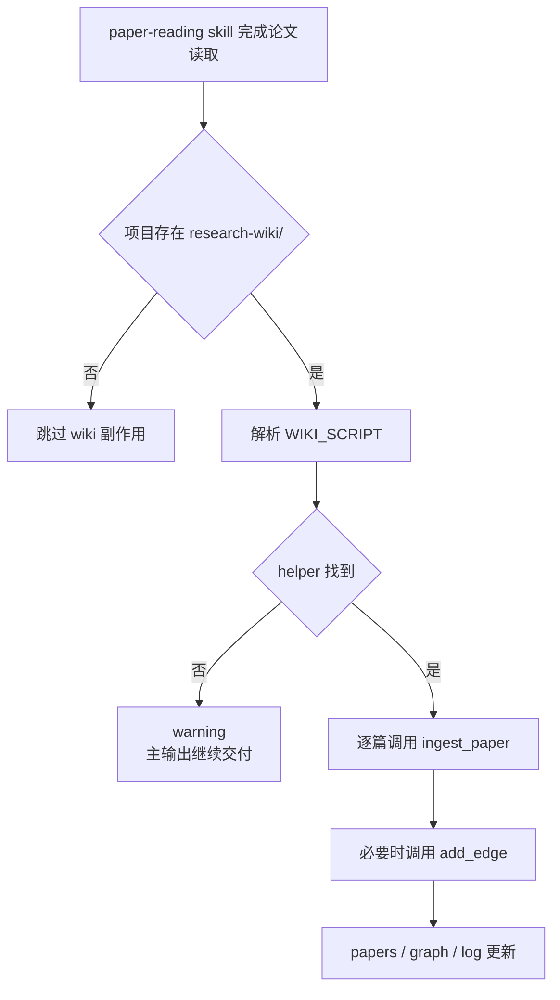

适用调用方包括：

- `/research-lit`
- `/arxiv`
- `/alphaxiv`
- `/deepxiv`
- `/semantic-scholar`
- `/exa-search`

这些调用方不应该复制 ingest 业务逻辑，只能调用 `research_wiki.py ingest_paper`。

### 7.2 idea-creator -> wiki

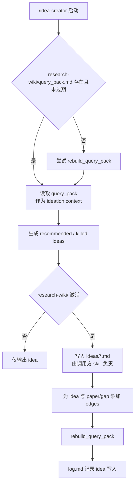

边界说明：当前 `tools/research_wiki.py` 已提供 `update`、`add_edge`、`rebuild_query_pack` 等基础能力；完整的 `upsert_idea` 页面写入逻辑主要由调用方 skill 约定执行，而不是 helper 中的独立子命令。

### 7.3 result-to-claim -> wiki

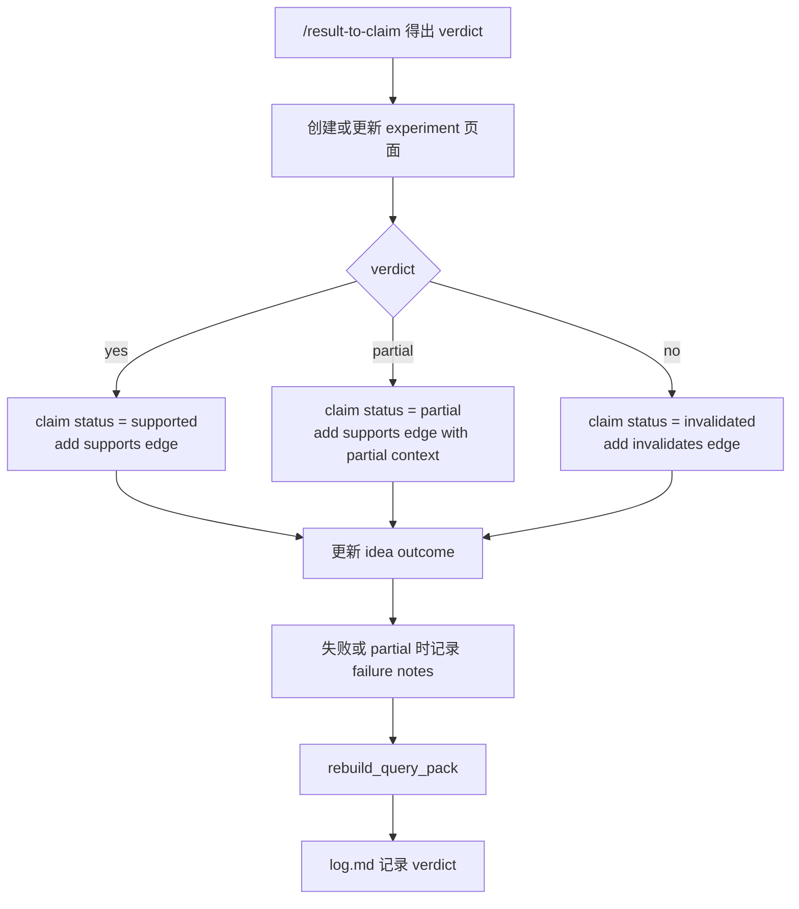

边界说明：`research_wiki.py update` 支持状态字段更新；实验页创建、failure notes 细节写入和多 claim 编排由调用方 workflow 负责。

## 8. CLI 子命令映射

| 用户语义 | Helper 子命令 | 当前状态 | 主要副作用 |
|---|---|---|---|
| 初始化 wiki | `init` | 已实现 | 创建目录、基础文件、`log.md` |
| 论文入库 | `ingest` / `ingest_paper` | 已实现 | 写 `papers/*.md`，重建 `index.md` / `query_pack.md`，写日志 |
| 批量回填 | `sync` | 已实现 | 批量调用 `ingest_paper` |
| Obsidian 投影同步 | `sync-obsidian` | 已实现 | 读取 PaperNotes，写 paper projection，重建派生文件，写日志 |
| 查询压缩包 | `query` / `rebuild_query_pack` | 已实现 | 写 `query_pack.md` |
| 更新实体字段 | `update` | 已实现 | 更新 frontmatter，重建派生文件，写日志 |
| 添加关系 | `add_edge` | 已实现 | 追加 `graph/edges.jsonl` |
| 重建索引 | `rebuild_index` | 已实现 | 写 `index.md` |
| 统计 | `stats` | 已实现 | stdout 输出数量统计 |
| 健康检查 | `lint` | 已实现 | 写 `LINT_REPORT.md` |
| 写审计日志 | `log` | 已实现 | 追加 `log.md` |
| slug 生成 | `slug` | 已实现 | stdout 输出 slug |

## 9. 派生文件与不变量

### 9.1 `index.md`

来源：扫描 `papers/`、`ideas/`、`experiments/`、`claims/` 中的 Markdown 页面。

写入时机：

- `ingest_paper`
- `update`
- 手动调用 `rebuild_index`

不变量：

- `index.md` 不应手改
- 页面缺少 `node_id` 时会退回到文件名派生 ID

### 9.2 `query_pack.md`

来源：`RESEARCH_BRIEF.md`、`gap_map.md`、失败 idea、paper projection、claim、experiment、recent edges。

写入时机：

- `init` 创建初始空文件
- `ingest_paper`
- `sync-obsidian`
- `update`
- 手动调用 `query` 或 `rebuild_query_pack`

不变量：

- 面向 `/idea-creator` 的紧凑上下文，不是完整知识库导出
- 默认最大 8000 字符
- 失败 idea 是最高价值信息，不应被随意剪掉
- 不展开 Obsidian 全量论文笔记，也不读取 Obsidian concept notes

### 9.3 `log.md`

来源：helper mutation receipt。

写入时机：

- `init`
- `ingest_paper` 新增、更新或跳过已有论文
- `update`
- 手动调用 `log`

不变量：

- 每次 mutation 都应留下可审计 receipt
- 调用方 workflow 如自行写 idea 或 experiment，也应追加日志

### 9.4 `graph/edges.jsonl`

来源：`add_edge` 或调用方 workflow 直接遵循同一 schema 写入。

不变量：

- 每行一个 JSON object
- `from`、`to` 使用 canonical node id
- 同一 `from` / `to` / `type` 组合不重复
- edge 是关系的结构化 source of truth

## 10. 失败模式与修复路径

| 失败模式 | 表现 | 根因 | 修复路径 |
|---|---|---|---|
| helper 找不到 | `/research-wiki` hard-fail，调用方 skill warning | 用户项目没有 `.aris/tools`，也没有本地 `tools/` 或 `$ARIS_REPO` | 重跑 `bash tools/install_aris.sh`，或设置 `$ARIS_REPO`，或复制 helper 到项目 `tools/` |
| 论文没有入库 | `research-wiki/papers/` 为空或缺少某篇 | wiki 初始化晚于阅读流程，或 hook 未触发 | 运行 `python3 "$WIKI_SCRIPT" sync research-wiki/ --arxiv-ids ...` |
| Obsidian 同步误匹配风险 | dry-run 中出现意外 update | normalized title 或 `method_name` 弱匹配可能碰撞 | 默认不用弱匹配；只有检查报告后才加 `--match-loose` |
| arXiv 拉取失败 | `ingest_paper` 报网络或 XML 错误 | 网络、arXiv API、ID 错误 | 用 `--title --authors --year --venue` 提供手动 metadata，或稍后重试 |
| 重复 ingest | stdout 显示 already ingested | arXiv ID 或 slug 已存在 | 默认跳过；需要覆盖时加 `--update-on-exist` |
| graph 关系缺失 | `lint` 报 orphan 或 missing connections | 只写了实体页，没有补 `add_edge` | 调用 `add_edge` 补关系，并按需 `query` 重建 `query_pack.md` |
| claim 状态长期 reported | `lint` 报 stale claims | 实验结果未回写 claim | 用 `update` 修改 status，并添加 `supports` 或 `invalidates` edge |
| 同一 claim 证据冲突 | `lint` 报 contradictions | graph 同时存在支持和否定证据 | 人工检查实验条件，更新 claim 状态和 evidence |
| 页面信息稀疏 | `lint` 报 sparse pages | ingest 后没有补结构化阅读字段 | 填写高价值字段，或记录为什么保留 TODO |

## 11. 维护原则

1. 业务逻辑只能有一个 canonical helper。新增 ingest、update、lint 行为时优先扩展 `tools/research_wiki.py`，不要在多个 skill 中复制实现。
2. 所有跨 skill 写 wiki 的行为必须有可观察 artifact：页面、edge、log entry 或 report。
3. 调用方 skill 不应硬编码 `python3 tools/research_wiki.py`。必须走 helper resolution chain。
4. `research-wiki/` 是项目数据，不是 ARIS 源码目录的一部分。不要让 helper 隐式扫描不受控路径写数据。
5. `graph/edges.jsonl` 是关系 source of truth。页面正文可以服务人类阅读，但不能替代结构化 edge。
6. `query_pack.md` 是消费侧缓存。改动实体或关系后，如果后续要给 `/idea-creator` 使用，需要确保它被重建。
7. 诊断工具分清 blocking 和 diagnostic。`lint` 和 `verify_wiki_coverage.sh` 当前主要用于发现问题，不应被误描述为所有流程的强制 gate。
8. Obsidian owns full paper notes；Research Wiki owns ARIS project state。不要在 Wiki 中新增或维护 `concepts/`。

## 12. 相关文件

| 文件 | 作用 |
|---|---|
| `tools/research_wiki.py` | Research Wiki canonical helper |
| `skills/research-wiki/SKILL.md` | 用户命令和工作流说明 |
| `skills/shared-references/wiki-helper-resolution.md` | helper 解析链规范 |
| `skills/shared-references/integration-contract.md` | 跨 skill 集成契约 |
| `tools/verify_wiki_coverage.sh` | wiki 覆盖诊断 |
| `tests/test_research_wiki_helper_resolution.py` | helper 解析链回归测试 |
| `tests/test_research_wiki_cli.py` | wiki CLI 行为回归测试 |
| `tests/test_research_wiki_obsidian_parser.py` | Obsidian PaperNotes 解析测试 |
| `tests/test_research_wiki_resolver.py` | paper identity resolver 测试 |
| `tests/test_research_wiki_zotero.py` | Zotero 只读 metadata enrichment 测试 |
| `tests/test_research_wiki_renderer.py` | paper projection renderer 测试 |
| `tests/test_research_wiki_query_pack.py` | query_pack projection/claim/experiment 测试 |
