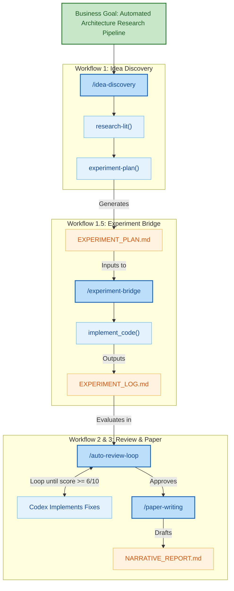

 

```mermaid
graph TD
%% High-contrast colors
classDef goal fill:#c8e6c9,color:#1a5e20,stroke:#2e7d32,stroke-width:2px;
classDef workflow fill:#bbdefb,color:#0d47a1,stroke:#1565c0,stroke-width:2px;
classDef step fill:#e3f2fd,color:#0d47a1,stroke:#64b5f6;
classDef doc fill:#fff3e0,color:#e65100,stroke:#ffb74d;

Goal["Business Goal: Automated Architecture Research Pipeline"]:::goal

subgraph "Workflow 1: Idea Discovery"
    w1_1["/idea-discovery"]:::workflow
    w1_2["research-lit()"]:::step
    w1_3["experiment-plan()"]:::step
end

subgraph "Workflow 1.5: Experiment Bridge"
    w15_1["/experiment-bridge"]:::workflow
    w15_2["EXPERIMENT_PLAN.md"]:::doc
    w15_3["implement_code()"]:::step
    w15_4["EXPERIMENT_LOG.md"]:::doc
end

subgraph "Workflow 2 & 3: Review & Paper"
    w2_1["/auto-review-loop"]:::workflow
    w2_2["Codex Implements Fixes"]:::step
    w3_1["/paper-writing"]:::workflow
    w3_2["NARRATIVE_REPORT.md"]:::doc
end

%% Flow
Goal --> w1_1
w1_1 --> w1_2
w1_2 --> w1_3
w1_3 -->|"Generates"| w15_2
w15_2 -->|"Inputs to"| w15_1
w15_1 --> w15_3
w15_3 -->|"Outputs"| w15_4
w15_4 -->|"Evaluates in"| w2_1
w2_1 <-->|"Loop until score >= 6/10"| w2_2
w2_1 -->|"Approves"| w3_1
w3_1 -->|"Drafts"| w3_2
```

