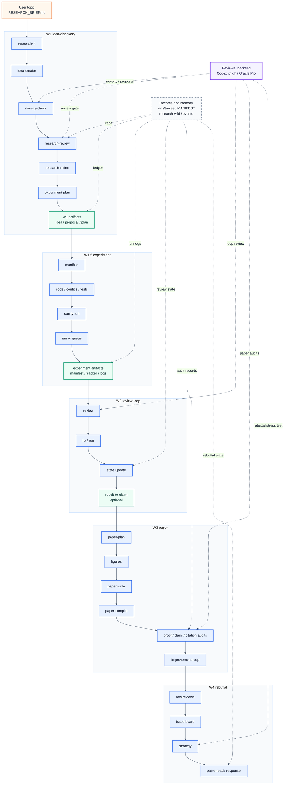
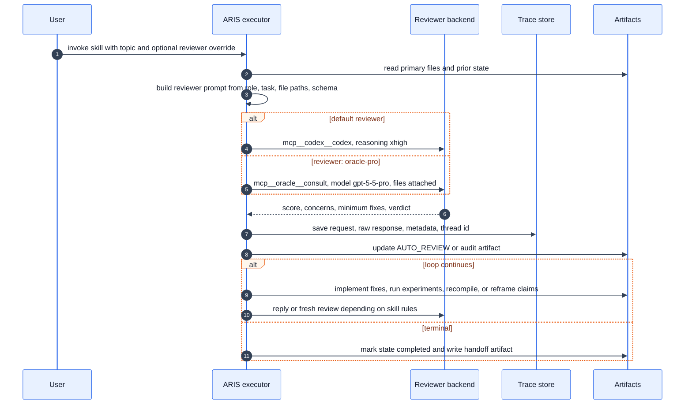

# ARIS Workflow Map for Wanli

本文档把当前仓库的 ARIS 工作流展开到 skill、reviewer、状态文件和中间产物级别。它不是营销版总览，而是用于判断一次研究自动化运行是否漏步骤、漏审稿、漏记录的执行地图。

## 结论

原始 `WORKFLOW_WANLI.md` 只画出了 `/idea-discovery -> /experiment-bridge -> /auto-review-loop -> /paper-writing` 的主干，遗漏了这些实际流程：

- Workflow 1 内部的 `idea-creator`、`novelty-check`、`research-review`、`research-refine`、`experiment-plan`。
- reviewer routing：默认 Codex MCP xhigh，显式 `-- reviewer: oracle-pro` 才走 Oracle GPT-5.5 Pro。
- reviewer trace：每次 reviewer/critique 调用应写 `.aris/traces/<skill>/<UTC-date>_runNN/`。
- 状态恢复：`refine-logs/REFINE_STATE.json`、`review-stage/REVIEW_STATE.json`、`rebuttal/REBUTTAL_STATE.md`。
- 产物追踪：`MANIFEST.md`、timestamped artifact、latest copy。
- Workflow 1.5 的 `run-experiment` / `experiment-queue` 路由、sanity run、code/config review。
- Workflow 2 终止时的 `result-to-claim` 和 `CLAIMS_FROM_RESULTS.md`。
- Workflow 3 的 proof / claim / citation audit，以及 submission verifier。
- Workflow 4 `/rebuttal`。
- 横向记忆与优化：`research-wiki`、`.aris/meta/events.jsonl`、`meta-optimize`。

## End-to-End Diagram

图源文件：

- `figures/aris-workflow-wanli-overview.mmd`
- `figures/aris-workflow-wanli-overview.md`



## Reviewer Interaction Diagram

图源文件：

- `figures/aris-reviewer-interaction.mmd`
- `figures/aris-reviewer-interaction.md`



## Workflow Details

### Workflow 1: Idea Discovery

Command:

```bash
/idea-discovery "topic"
```

Actual chain:

```text
research-lit -> idea-creator -> novelty-check -> research-review -> research-refine -> experiment-plan
```

Inputs:

- User topic or `RESEARCH_BRIEF.md`.
- Existing `research-wiki/` if initialized.
- Local papers, Zotero, web/arXiv/Semantic Scholar depending on selected sources.
- Domain constraints from `AGENTS.md`.

Important outputs:

- `nic-lossless-compression/research-lit/<UTC-date>.md` or topic-scoped literature report.
- `idea-stage/IDEA_REPORT.md` and timestamped copy.
- `idea-stage/IDEA_CANDIDATES.md` and timestamped copy.
- `refine-logs/FINAL_PROPOSAL.md`.
- `refine-logs/REVIEW_SUMMARY.md`, `refine-logs/score-history.md`, `refine-logs/round-*.md`.
- `refine-logs/EXPERIMENT_PLAN.md`.
- `refine-logs/PIPELINE_SUMMARY.md`.
- `MANIFEST.md` rows for every durable artifact.
- Optional `research-wiki/` updates.
- Reviewer traces under `.aris/traces/` for `research-review`, `research-refine`, novelty or idea critiques.

Missing detail in the original diagram: Workflow 1 is not just literature plus plan. It has at least two reviewer-facing gates: idea critique / novelty risk and proposal refinement.

### Workflow 1.5: Experiment Bridge

Command:

```bash
/experiment-bridge
```

Inputs:

- `refine-logs/EXPERIMENT_PLAN.md`.
- Optional `refine-logs/EXPERIMENT_TRACKER.md`.
- Optional `refine-logs/FINAL_PROPOSAL.md`.
- Backend constraints: gem5, htsim, co-simulation, RTL/HLS, microbenchmarks, or analytical model.

Internal stages:

1. Parse claim, baseline, ablation, metric, and backend requirements.
2. Write or update `refine-logs/EXPERIMENT_MANIFEST.yaml`.
3. Generate scripts, configs, tests, simulator glue, and result directories.
4. Run the smallest sanity case first.
5. Review code/config before expensive runs.
6. Route execution:
   - small one-off job -> `/run-experiment`;
   - grid, many seeds, or phase dependencies -> `/experiment-queue`.
7. Collect logs/results into `refine-logs/EXPERIMENT_LOG.md` or project-specific experiment result files.

Important outputs:

- `refine-logs/EXPERIMENT_MANIFEST.yaml`.
- `refine-logs/EXPERIMENT_TRACKER.md`.
- `refine-logs/EXPERIMENT_LOG.md`.
- Experiment code/configs/tests, for this repo currently under `experiments/rx-expansion/` and `tests/`.
- Result files such as `.json`, `.csv`, reports, plots, simulator logs.

Missing detail in the original diagram: `experiment-bridge` is not only "implement_code"; it must preserve claim boundaries, run sanity checks, and produce machine-readable evidence for later audits.

### Workflow 2: Auto Review Loop

Command:

```bash
/auto-review-loop "scope"
```

Inputs:

- `refine-logs/EXPERIMENT_PLAN.md`.
- Experiment results and logs.
- Implementation code.
- `review-stage/AUTO_REVIEW.md` and `review-stage/REVIEW_STATE.json` if resuming.
- Optional `findings.md` / `EXPERIMENT_LOG.md` when compact mode is enabled.

Reviewer modes:

- `medium`: Codex MCP xhigh review.
- `hard`: reviewer memory plus debate protocol.
- `nightmare`: reviewer reads repo directly and verifies code/results.
- `-- reviewer: oracle-pro`: one-shot or final stress review through Oracle GPT-5.5 Pro when explicitly requested.

Loop details:

```text
Phase A: reviewer reads artifacts and scores work
Phase B: executor parses score, verdict, critical weaknesses
Phase B.5: reviewer memory update, hard/nightmare only
Phase B.6: debate protocol, hard/nightmare only
Human checkpoint: optional
Phase C: implement fixes or launch experiments
Phase D: wait for results
Phase E: document round and update REVIEW_STATE
Repeat until score threshold or max rounds
```

Important outputs:

- `review-stage/AUTO_REVIEW.md`.
- `review-stage/AUTO_REVIEW_<UTC timestamp>.md`.
- `review-stage/REVIEW_STATE.json`.
- `review-stage/REVIEW_STATE_<UTC timestamp>.json`.
- Optional `CLAIMS_FROM_RESULTS.md` from `/result-to-claim`.
- Optional updates to `research-wiki/ideas/*`, `research-wiki/claims/*`, and graph edges.
- `.aris/traces/auto-review-loop/...` or `.aris/traces/research-review/...`.

Missing detail in the original diagram: Workflow 2 is not just review/fix. It owns reviewer memory, debate, state recovery, raw response preservation, Feishu notifications when configured, and the bridge to claims for paper writing.

### Workflow 3: Paper Writing

Command:

```bash
/paper-writing "NARRATIVE_REPORT.md"
```

Inputs:

- `NARRATIVE_REPORT.md` or `STORY.md`.
- `CLAIMS_FROM_RESULTS.md` if generated.
- `review-stage/AUTO_REVIEW.md`.
- `idea-stage/IDEA_REPORT.md`.
- Experiment result files, figure/table data, and known limitations.
- Optional existing `PAPER_PLAN.md` to skip planning.

Detailed chain:

```text
paper-plan -> paper-figure -> figure-spec/paper-illustration/mermaid-diagram
-> paper-write -> paper-compile
-> proof-checker if theory
-> paper-claim-audit
-> auto-paper-improvement-loop
-> final paper-claim-audit
-> citation-audit
-> tools/verify_paper_audits.sh
-> final report
```

Important outputs:

- `PAPER_PLAN.md`.
- `figures/` scripts, plots, tables, specs, SVG/PDF/PNG.
- `paper/main.tex`.
- `paper/sections/*.tex`.
- `paper/references.bib`.
- `paper/main.pdf`.
- `PAPER_IMPROVEMENT_LOG.md`.
- `paper/PROOF_AUDIT.{md,json}` when applicable.
- `paper/PAPER_CLAIM_AUDIT.{md,json}`.
- `paper/CITATION_AUDIT.{md,json}`.
- `paper/.aris/audit-verifier-report.json`.
- Final paper-writing report.

Missing detail in the original diagram: Workflow 3 has multiple assurance gates. A paper can compile and still fail submission readiness if claim, proof, or citation audits fail.

### Workflow 4: Rebuttal

Command:

```bash
/rebuttal "paper/ + reviews" -- venue: ICML
```

Inputs:

- Paper source or PDF.
- Raw external reviews.
- Venue rules, length limit, response mode.
- Current stage: initial rebuttal or follow-up.

Outputs:

- `rebuttal/REVIEWS_RAW.md`.
- `rebuttal/ISSUE_BOARD.md`.
- `rebuttal/STRATEGY_PLAN.md`.
- `rebuttal/EVIDENCE_LEDGER.md`.
- `rebuttal/REBUTTAL_DRAFT_rich.md`.
- `rebuttal/PASTE_READY.txt`.
- `rebuttal/REVISION_PLAN.md`.
- `rebuttal/FOLLOWUP_LOG.md` for later rounds.
- `rebuttal/REBUTTAL_STATE.md`.

Safety gates:

- provenance gate: every factual statement has a source.
- commitment gate: every promise is approved or marked future work.
- coverage gate: every reviewer concern is answered, deferred, or needs user input.

Missing detail in the original diagram: rebuttal is a first-class workflow, not an afterthought after paper writing.

## Skill Input / Output Matrix

| Skill | Main input | Reviewer interaction | Main output |
|---|---|---|---|
| `/research-pipeline` | broad topic, optional `RESEARCH_BRIEF.md` | delegates to child workflow reviewers | `NARRATIVE_REPORT.md`, pipeline report, optional paper |
| `/idea-discovery` | topic or brief | delegates to idea/review/refine skills | `idea-stage/IDEA_REPORT.md`, `idea-stage/IDEA_CANDIDATES.md` |
| `/research-lit` | topic, sources, optional wiki | optional deep reviewer for synthesis | topic-scoped literature report, wiki paper ingest |
| `/idea-creator` | research-lit output, wiki query pack, domain profile | external idea critique when configured | ranked ideas, pilot table, `IDEA_REPORT.md` |
| `/novelty-check` | top idea and related work | reviewer/critic call, traced | novelty risk report, prior-work objections |
| `/research-review` | proposal, plan, paper, results, file paths | Codex xhigh or Oracle Pro | review report, score, Go/No-Go, traces |
| `/research-refine` | selected idea and grounding material | multi-round proposal review | `FINAL_PROPOSAL.md`, `REVIEW_SUMMARY.md`, `REFINE_STATE.json` |
| `/experiment-plan` | refined proposal | may use reviewer feedback indirectly | `EXPERIMENT_PLAN.md`, tracker-ready milestones |
| `/experiment-bridge` | `EXPERIMENT_PLAN.md` | code/config review before expensive runs | manifest, scripts/configs/tests, `EXPERIMENT_LOG.md` |
| `/run-experiment` | one run spec | normally no reviewer | single run output, logs, status |
| `/experiment-queue` | job grid or phase manifest | normally no reviewer | queue state, wave results, retry/stuck status |
| `/auto-review-loop` | code/results/claims/scope | core iterative reviewer loop | `AUTO_REVIEW.md`, `REVIEW_STATE.json`, optional claims |
| `/result-to-claim` | results and review conclusions | Codex judge of claim support | `CLAIMS_FROM_RESULTS.md`, wiki claim updates |
| `/paper-writing` | `NARRATIVE_REPORT.md`, claims, review history | delegates to plan/audit/improvement reviewers | full paper directory, PDF, final report |
| `/paper-plan` | narrative, claims, review history | outline review via reviewer model | `PAPER_PLAN.md` |
| `/paper-figure` | paper plan and result data | figure quality review | reproducible figures, tables, LaTeX snippets |
| `/figure-spec` | architecture/workflow figure request | no external reviewer by default | deterministic SVG/PDF/spec JSON |
| `/paper-illustration` | method description | image generation/review path | AI-generated illustration assets |
| `/mermaid-diagram` | diagram request | syntax/visual verification | `.mmd`, `.md`, rendered image |
| `/paper-write` | `PAPER_PLAN.md` | section-level quality review | LaTeX source and bibliography |
| `/paper-compile` | `paper/` | no reviewer by default | `paper/main.pdf`, compile fixes |
| `/proof-checker` | paper proofs | rigorous reviewer/proof critic | `PROOF_AUDIT.{md,json}` |
| `/paper-claim-audit` | paper plus raw result files | zero-context reviewer | `PAPER_CLAIM_AUDIT.{md,json}` |
| `/citation-audit` | paper bibliography and citations | web/DBLP/arXiv-aware reviewer | `CITATION_AUDIT.{md,json}` |
| `/auto-paper-improvement-loop` | compiled paper | multi-round paper reviewer | improved PDFs, `PAPER_IMPROVEMENT_LOG.md` |
| `/rebuttal` | paper, raw reviews, venue rules | stress-test reviewer and follow-up continuity | rebuttal directory and paste-ready response |
| `/research-wiki` | papers, ideas, experiments, claims | no reviewer by default | persistent memory pages, graph edges, query pack |
| `/meta-optimize` | `.aris/meta/events.jsonl`, traces | reviewer-gated harness optimization | proposed skill/routing improvements |

## Reviewer and Trace Contract

Default reviewer behavior:

- All review calls default to Codex MCP with xhigh reasoning.
- `-- reviewer: oracle-pro` is explicit opt-in and routes to Oracle GPT-5.5 Pro when available.
- Browser-mode Oracle is acceptable for one-shot reviews, but not ideal for tight multi-round loops.
- Reviewer independence means the executor should pass primary file paths and tasks, not pre-digested summaries, whenever the reviewer can read files directly.

Trace files:

```text
.aris/traces/<skill>/<UTC-date>_runNN/
  run.meta.json
  001-<purpose>.request.json
  001-<purpose>.response.md
  001-<purpose>.meta.json
```

Trace metadata should preserve:

- skill and purpose;
- UTC timestamp;
- tool name, model, thread id;
- prompt snapshot;
- raw reviewer response.

## Artifact and State Map

```text
project/
  AGENTS.md                         # domain profile, current pipeline state
  MANIFEST.md                       # output ledger
  .aris/
    meta/events.jsonl               # hook/meta events
    traces/                         # reviewer call evidence
  research-wiki/                    # persistent papers/ideas/claims/experiments
  idea-stage/
    IDEA_REPORT.md
    IDEA_CANDIDATES.md
  refine-logs/
    FINAL_PROPOSAL.md
    REVIEW_SUMMARY.md
    REFINE_STATE.json
    EXPERIMENT_PLAN.md
    EXPERIMENT_MANIFEST.yaml
    EXPERIMENT_TRACKER.md
    EXPERIMENT_LOG.md
    PIPELINE_SUMMARY.md
  experiments/
    <project-specific code, configs, results>
  review-stage/
    AUTO_REVIEW.md
    REVIEW_STATE.json
  figures/
    scripts, specs, plots, tables, mermaid diagrams
  paper/
    main.tex
    sections/
    references.bib
    main.pdf
    PROOF_AUDIT.{md,json}
    PAPER_CLAIM_AUDIT.{md,json}
    CITATION_AUDIT.{md,json}
  rebuttal/
    REVIEWS_RAW.md
    ISSUE_BOARD.md
    STRATEGY_PLAN.md
    REBUTTAL_DRAFT_rich.md
    PASTE_READY.txt
    REVISION_PLAN.md
    REBUTTAL_STATE.md
```

## Current Repository-Specific Note

This repository is currently in `implementation` stage for:

```text
Rx Expansion Budgeting for Compressed RDMA
```

The active contract is `refine-logs/EXPERIMENT_PLAN.md`. The current next step is not to write paper claims yet; it is to proceed with M2 model plumbing only, with receiver decompressed-byte token bucket, static per-QP decompressed-byte cap, exact-original-byte receiver credits, queueing/control, Rx SRAM, decompressor/output-DMA service, and hardware-cost ablations. Real compressed communication payload behavior remains disallowed until P2/P3 evidence exists.

## Practical Checklist

Before calling a workflow "complete", check:

- Did every durable artifact get a `MANIFEST.md` row?
- Did reviewer calls write `.aris/traces/...`?
- Did state files mark `"status": "completed"` when the loop ended?
- Did Workflow 2 generate or explicitly skip `CLAIMS_FROM_RESULTS.md`?
- Did Workflow 3 run proof, claim, and citation audits when detectors matched?
- Did `tools/verify_paper_audits.sh` pass before declaring submission readiness?
- Did `AGENTS.md` Pipeline Status get updated on stage transition or handoff?
